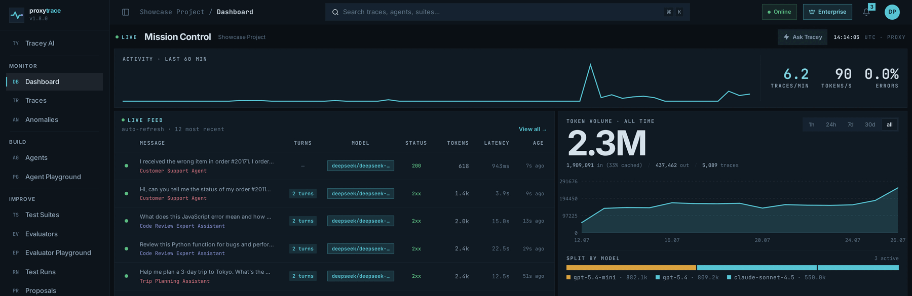
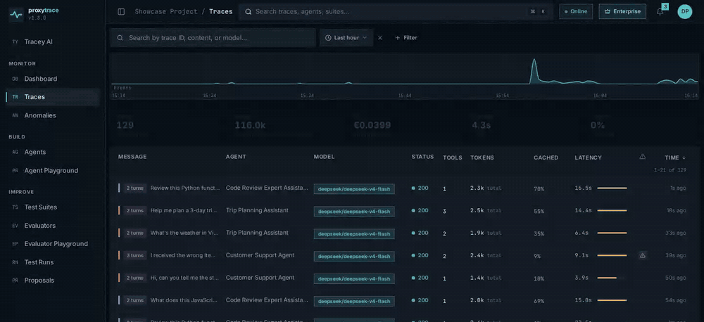
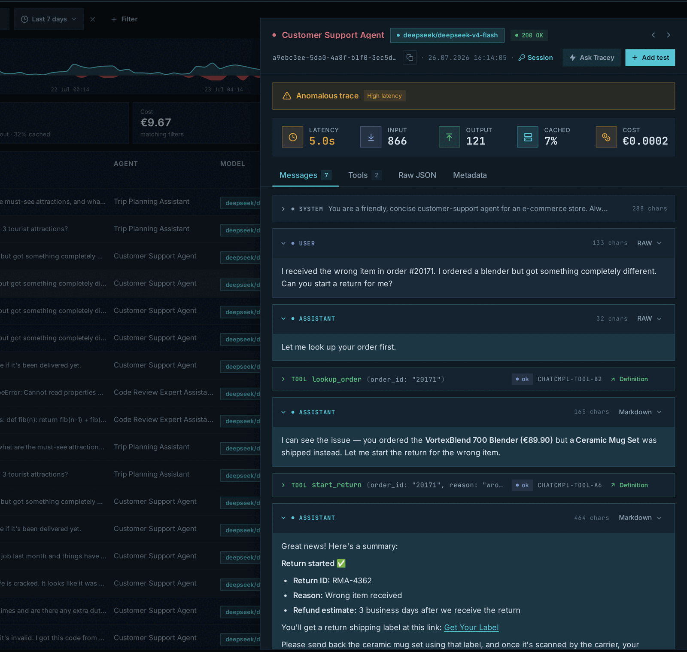
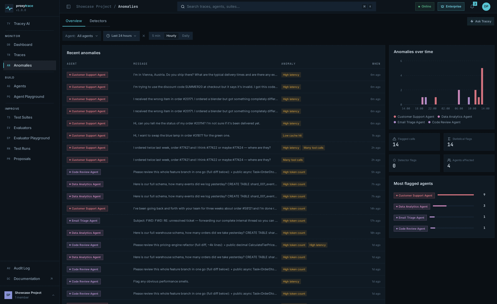
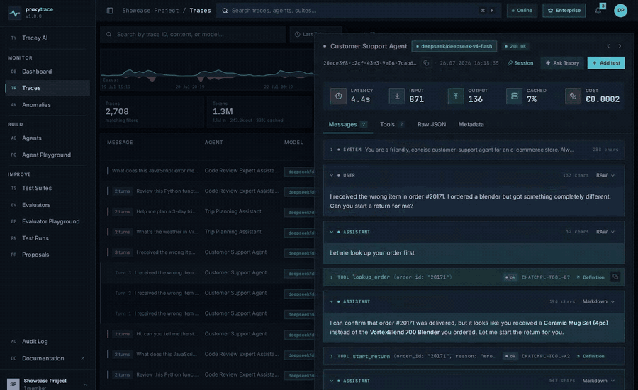
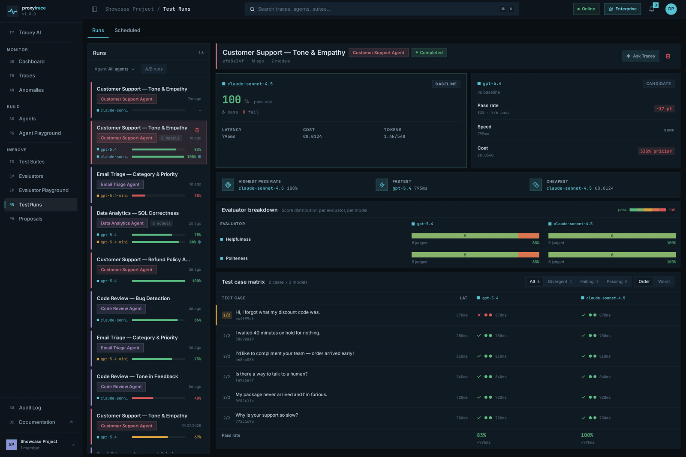
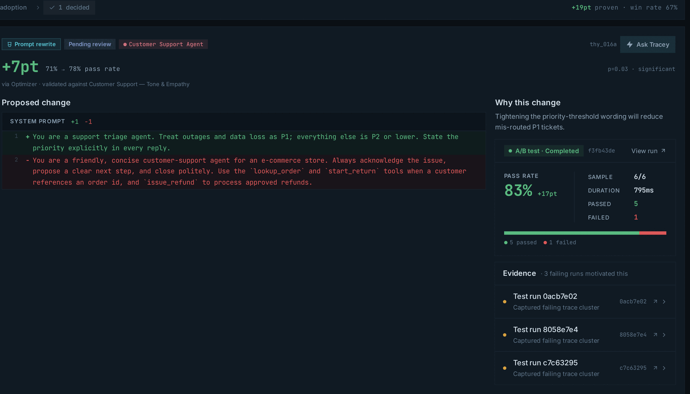
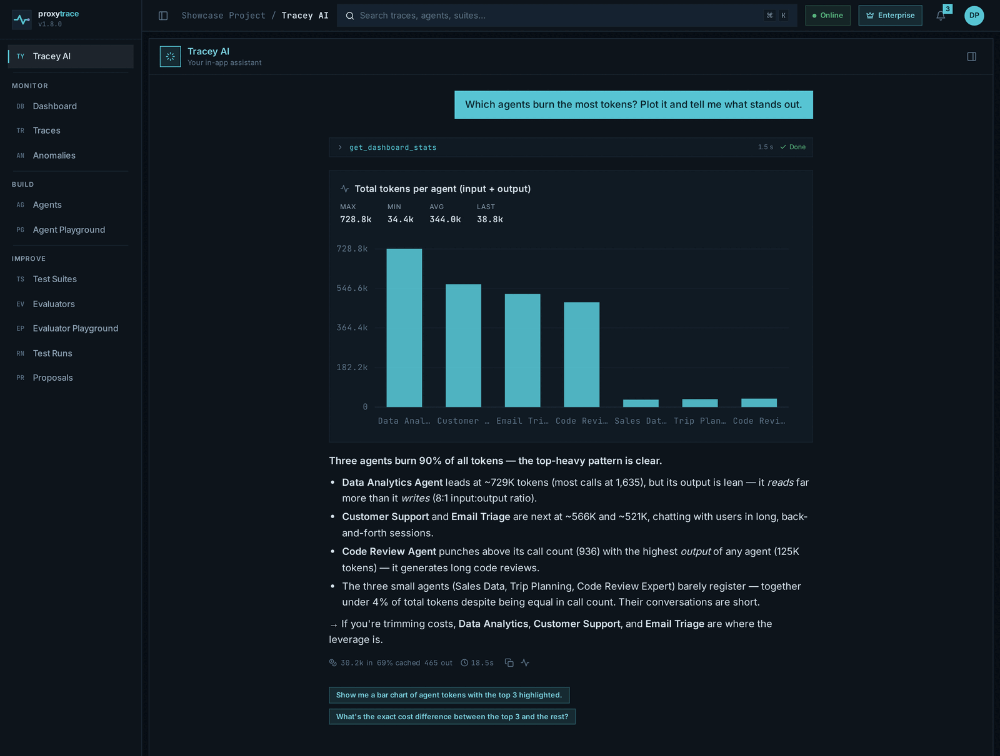
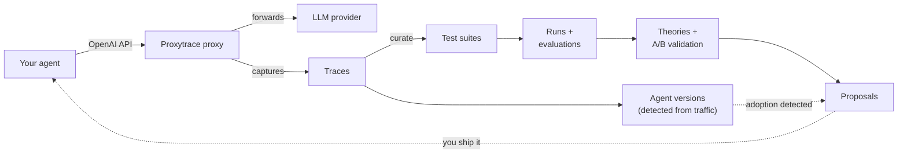

# Proxytrace

### The debugger, unit test framework, and mission control for AI agents

Proxytrace captures every LLM call, turns real traffic into test suites, and tells you exactly
what to fix. Self-hosted, one container. **Ship with evidence, not vibes.**

[](https://github.com/SyntaktikEU/Proxytrace/releases)
[](https://github.com/SyntaktikEU/Proxytrace/actions/workflows/ci.yml)
[](LICENSE)
[](#nothing-leaves-your-network)

**Change one line. That's the integration.**

```diff
  client = OpenAI(
-     base_url="https://api.openai.com/v1",
+     base_url="http://localhost:5102/openai/v1",
      api_key="<proxytrace API key>",
  )
```

`1` line changed · `0` SDKs to install · `100%` of calls captured



*Nothing changed but the base URL.* &nbsp;`> proxytrace.local · /dashboard`

**[Run it](#run-it)** · [proxytrace.dev](https://proxytrace.dev) · [Manual](manual/) · [Changelog](CHANGELOG.md)

---

`SEC.01 · CAPTURE`
## And then: every call lands.<br>Nothing sampled. Nothing dropped.

> The proxy is a thin reverse proxy on the hot path and capture is asynchronous, so your
> agent's latency is untouched.

*Rows arrive on their own. Nobody pressed refresh.*



`> proxytrace.local · /traces`

Requests reach your provider untouched — every client header travels upstream unchanged. Three
optional headers are read by Proxytrace, stripped, and never forwarded:

| Header | What it buys you |
|---|---|
| `x-proxytrace-agent` | Names the agent explicitly, instead of inferring it from prompt similarity. |
| `x-proxytrace-conversation-id` | Groups turns into one conversation. |
| `x-proxytrace-session-id` | Collects traces across agents and conversations into one debugging session. |

### Open any call. Read the whole conversation.

*Not a log line. The system prompt the model actually received, every tool round-trip, the reply.*



`> proxytrace.local · /traces` — server-side sort and stacking filters across every matching trace

`prompts · tools · parameters · tokens · cache hits · latency · cost in €`

### And the bad ones raise their hand.

*Per-agent baselines, not thresholds you have to guess at.*



`high tokens · high latency · many tool calls · low cache hit`

Custom detectors review trigger-matched calls against rules you write in plain language, and can
block a matching request at the proxy before it ever reaches the provider. `ENTERPRISE`

---

`SEC.02 · TESTS`
## And then: a trace becomes a test.<br>And "what got worse since Friday?" has an answer.

> A call that embarrassed you in production is the best test case you will ever write.

*Two clicks: correct the answer, pick the suite. It is a regression test from now on.*



`> proxytrace.local · /traces` — promote a trace as-is, correct it, or write a case from scratch

Evaluators are the assertions: `exact match · numeric · JSON schema · LLM-judged`. The first three
are free; the judged kind `ENTERPRISE` ships with Helpfulness, Politeness, Safety and Tool Usage
presets, or you write the rubric yourself.

### Race your production model against a candidate.

*One suite, two endpoints, every case scored side by side.*



`> proxytrace.local · /runs` — highest pass rate · fastest · cheapest, resolved per run

Models are non-deterministic, so a run can sample each endpoint up to five times and report the
pass fraction per case. Runs stream in live, and can be scheduled on a cadence. `ENTERPRISE`

---

`SEC.03 · PROPOSALS`
## And then: you get told<br>exactly what to fix.

> Failing runs become theories, theories are A/B tested against your own suite, and only the
> winners reach you.

*It opens on a diff you wrote. It closes on a diff Proxytrace wrote.*



`> proxytrace.local · /proposals` — `3 samples per arm · p ≤ 0.05` before a candidate wins

**Promote does not deploy anything.** Proxytrace is an observing proxy: it cannot reach into your
code, and it does not pretend to. Promoting hands you the change — copy buttons, a markdown
handoff, an artifact endpoint — and starts watching. When that exact prompt shows up in live
traffic, the proposal flips itself to **Adopted**. `ENTERPRISE`

---

`SEC.04 · AGENTS`
## And then: hand the whole loop to an agent.

> Everything a human can do here, an agent can do over an API.



*Tracey answers from your project's live data — and reads whole traces, curates suites, starts
runs, and works a reported defect test-first.* `ENTERPRISE`

Every project is also a [Model Context Protocol](https://modelcontextprotocol.io) server at `/mcp`,
on every tier. Point Claude Code or Cursor at it and your coding agent inspects the traces your
last run produced, records corrections, curates suites, starts runs, and compares them — with a
scoped API key, no login.

---

## The loop

> It doesn't end. It closes.



---

## Run it

> Web UI, API, ingestion proxy, database and queue — one image, one command.

```bash
docker run -d --name proxytrace \
  -p 5101:80 -p 5102:8081 \
  -v proxytrace:/data \
  ghcr.io/proxytrace/proxytrace
```

1. Open **http://localhost:5101** and follow the first-run setup.
2. Create an API key.
3. Point your agent's OpenAI base URL at `http://localhost:5102/openai/v1`.

`OpenAI · Azure OpenAI · any OpenAI-compatible endpoint` · `linux/amd64 · linux/arm64`

The manual is served at **http://localhost:5101/docs**. For production, every
[release](https://github.com/SyntaktikEU/Proxytrace/releases) ships a `proxytrace.zip` with a pinned
Compose file for app + PostgreSQL + Redis. Also on Docker Hub as `proxytrace/proxytrace` — same
tags, same digests.

## Nothing leaves your network

Proxytrace runs entirely on your infrastructure. Your prompts, responses and provider keys stay on
your machines — keys encrypted at rest under a Data Protection key ring you own. The one exception:
the proxy forwards each request to whichever LLM provider you pointed it at, exactly as your client
would have. For installs with no outbound internet at all, licenses can be verified offline, on-box.

## Free and Enterprise

Everything you have read up to `SEC.03` — capture, sessions, anomaly detection, suites, runs, the
MCP server — is on the Free tier, capped at **10,000 traces/month**, 14-day retention, and one
project, user, agent and suite. Enterprise lifts every cap to unlimited with 365-day retention, and
unlocks what is marked `ENTERPRISE` above: LLM-judged and custom evaluators, the optimization loop,
Tracey, scheduled runs, custom detectors, SSO (OIDC) and the audit log.

Pricing: [proxytrace.dev](https://proxytrace.dev)

## License

Proxytrace is **source-available** under the [Elastic License 2.0](LICENSE) — read it, build it,
run it, modify it. Three limitations: no offering Proxytrace to third parties as a hosted or managed
service, no circumventing the license-key functionality, and licensing notices stay put.

Paid tiers are unlocked with license keys we issue. Commercial licensing, managed-service
arrangements, or anything beyond the ELv2 grant: <office@syntaktik.eu>.

<p align="center">
  <strong>Stop guessing what your agents did.</strong><br><br>
  <code>docker run -d -p 5101:80 -p 5102:8081 -v proxytrace:/data ghcr.io/proxytrace/proxytrace</code>
</p>

<p align="center">
  <a href="https://proxytrace.dev">proxytrace.dev</a> ·
  <a href="manual/">Manual</a> ·
  <a href="CONTRIBUTING.md">Contributing</a> ·
  <a href="SECURITY.md">Security</a> ·
  <code>MADE IN THE EU</code>
</p>
